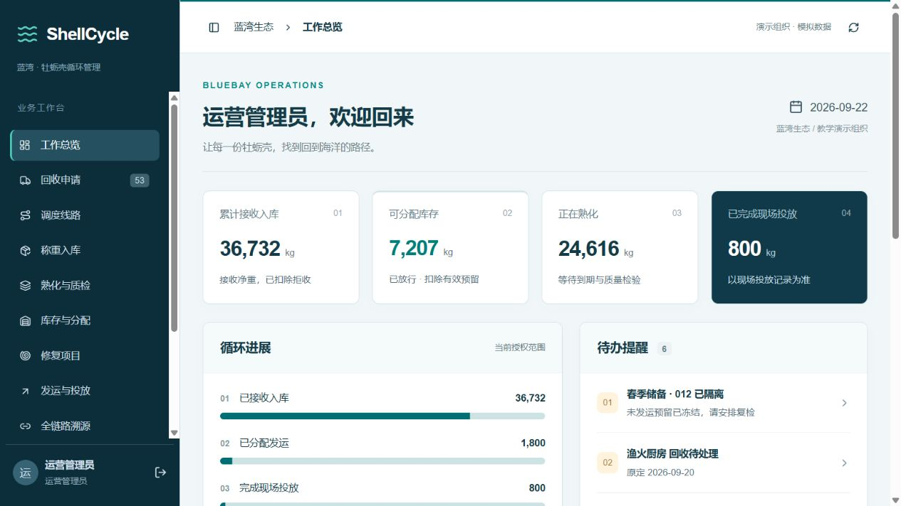
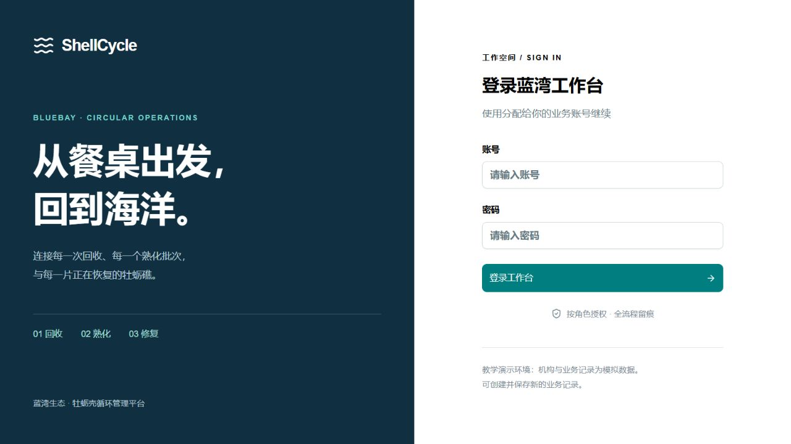
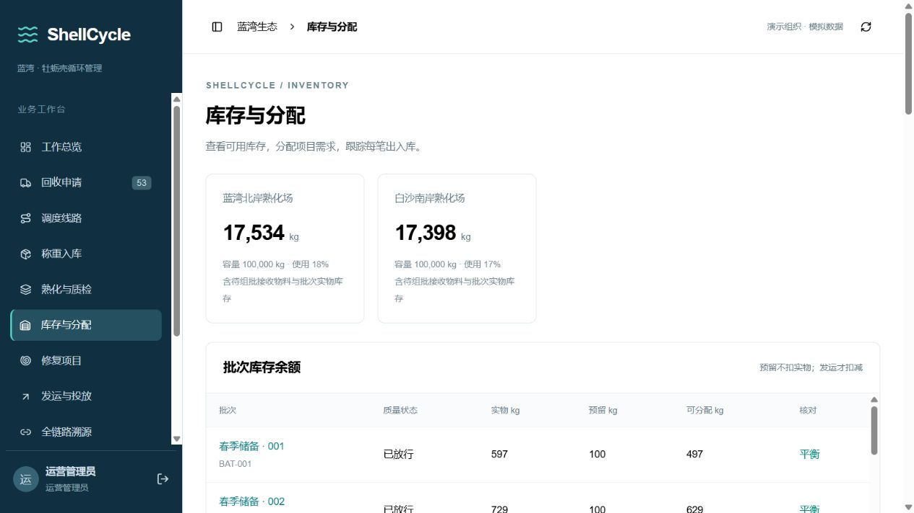
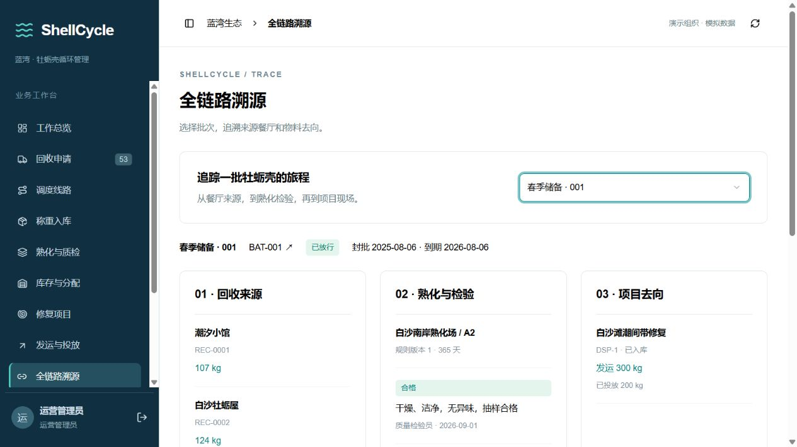
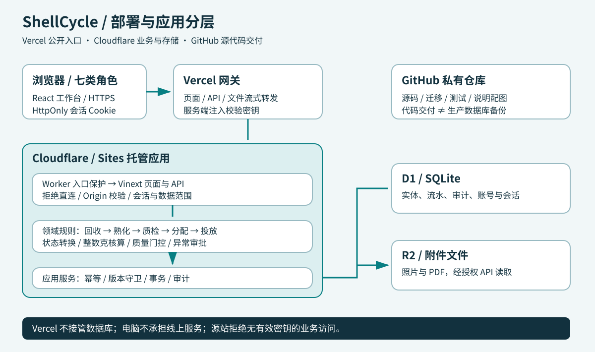
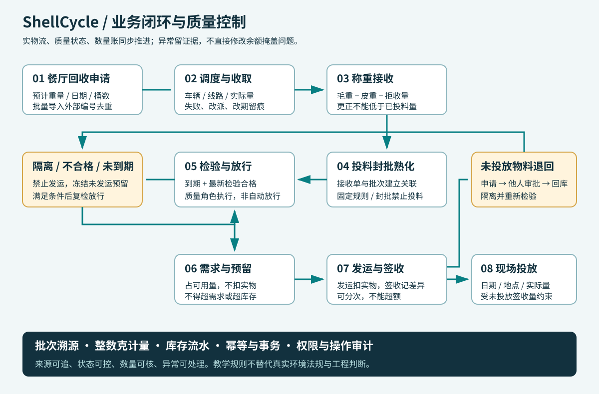
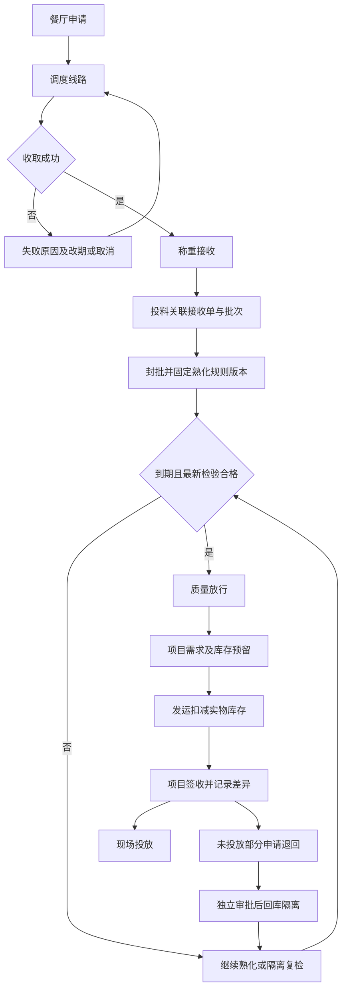
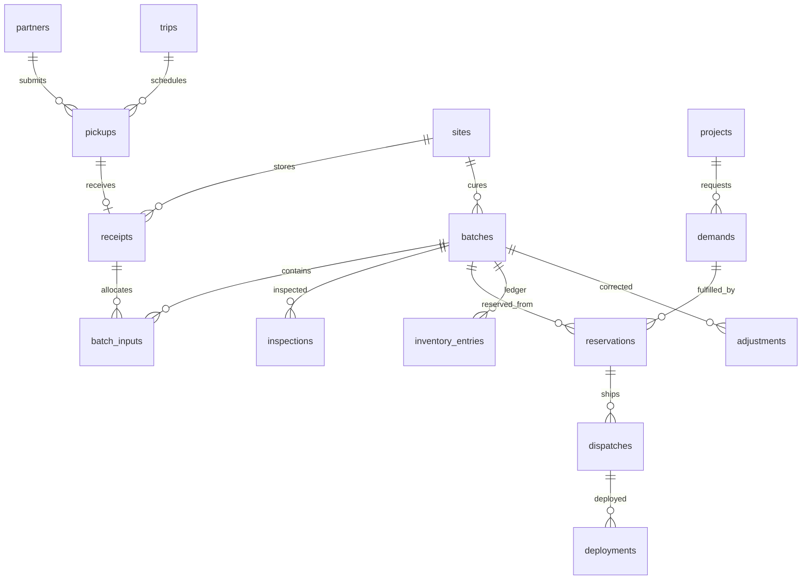
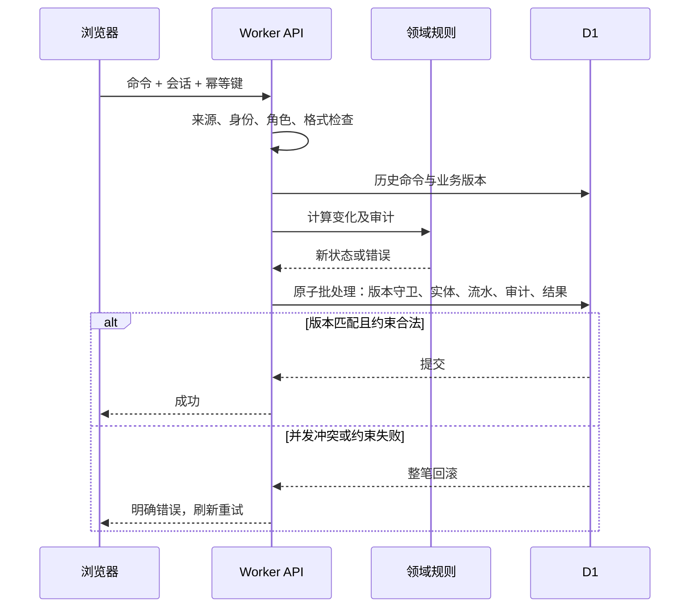

# ShellCycle · 蓝湾牡蛎壳循环管理

从餐厅回收，到熟化质检，再到牡蛎礁修复现场。一个具备七类角色、持久化数据库、库存核算、异常审批与批次溯源的系统分析与设计课程项目。

> **案例说明**：基于真实牡蛎壳回收与生态修复业务进行教学建模。“蓝湾生态”、餐厅、项目与业务记录均为模拟数据。系统真实可操作，但不是实际企业的生产系统，熟化参数不构成环境法规或工程实施建议。



## 导航

[访问账号](#访问与测试账号) · [功能](#业务场景与功能范围) · [截图](#真实网站截图) · [架构](#技术架构) · [流程](#业务流程) · [数据](#数据模型与一致性) · [安全](#权限与安全) · [运行](#本地运行) · [测试](#测试与验收) · [部署](#部署与运维)

## 访问与测试账号

访问：[ShellCycle 工作台](https://shellcycle.vercel.app/)。实际切换验收结果见 [部署记录](docs/deployment.md)。

Vercel 是访问网关，业务执行、数据库及附件仍在 Cloudflare；没有迁移数据库。本地电脑关机不影响已部署系统。

初始测试密码统一为 `Reef!2026Cycle`，修改后以管理员提供的密码为准。演示账号不可用于真实敏感数据。

| 账号 | 角色 | 授权用途 |
|---|---|---|
| `admin` | 运营管理员 | 全局业务、基础设置、账号管理、备份 |
| `restaurant` | 餐厅联系人 | PAR-1 餐厅的申请及相关记录 |
| `dispatcher` | 调度员 | 回收线路、车辆和任务安排 |
| `driver` | 回收司机 | 仅分配给当前司机的线路、任务及相关餐厅 |
| `operator` | 场地操作员 | SITE-1 的称重、投料和出库 |
| `qa` | 质量检验员 | 检验、放行、隔离及相应审批 |
| `project` | 项目负责人 | PRO-1 的需求、签收与投放 |

建议演示：总览 → 餐厅申请 → 调度收取 → 称重投料 → 质检放行成熟批次 → 预留发运 → 签收投放 → 溯源。新批次不能跳过熟化期限，快速演示出库使用预置成熟批次。

## 业务场景与功能范围

牡蛎壳不是普通商品库存：收取量可能不同于称重接收量；入场后必须组批熟化；满足质量要求才能用于修复。发运、签收、现场投放分别计量。系统围绕协同、质量、数量、异常和责任设计，而非只有增删改查。

| 模块 | 已实现功能 | 关键约束 |
|---|---|---|
| 总览 | 入库、库存、熟化、投放指标与待办 | 按当前授权范围统计 |
| 回收申请 | 新建、取消、批量导入、失败、改期 | 外部编号去重，无效导入整批拒绝 |
| 调度线路 | 车辆司机、任务分组、改派、取消 | 取消释放未执行任务 |
| 称重入库 | 毛重、皮重、拒收、接收量及更正 | 更正不能少于已投料量 |
| 熟化质检 | 建批、投料、封批、检验、放行、隔离 | 封批禁投料，期限与检验双门控 |
| 库存分配 | 实物、预留、可分配量、流水、调整审批 | 不得超分配，不得自批 |
| 修复项目 | 项目、需求、需求关闭、项目关闭 | 存在未结事项时不可直接关闭 |
| 发运投放 | 分次发运、签收差异、投放、退回 | 不得超发、超签收、超投放 |
| 溯源 | 来源、投料重量、检验、项目去向、定位链接 | 不声称识别混合批次每枚壳的餐厅 |
| 报表审计 | 汇总、筛选分页、CSV、字段前后变化 | 报表和日志不绕过数据权限 |
| 基础设置 | 餐厅、场地、车辆、规则版本、业务账号 | 服务端角色控制 |
| 附件备份 | 图片/PDF、授权下载、业务 JSON 导出 | 单附件最多 5 MB，业务导出不含文件与密码材料 |

## 真实网站截图

图片直接截自运行中的网站，不是设计稿或 AI 合成界面；业务数据为模拟数据，实际操作后数字会变化。

### 登录



### 库存与分配



### 全链路溯源



## 技术架构



| 分区 | 技术与代码 | 职责 |
|---|---|---|
| 界面 | React 19、TypeScript、Tailwind 4、shadcn/Radix；`app/` | 登录、表单、列表、报表与溯源 |
| 公开入口 | Vercel 外部重写；`deploy/gateway/` | 转发页面/API/文件，注入服务端校验头 |
| 源站保护 | `worker.ts`、`lib/gateway.ts` | 拒绝线上直连，保留原始 Origin |
| 渲染接口 | Vinext + Vite、Cloudflare Worker；`app/api/` | 页面渲染、请求校验、会话、业务调用 |
| 领域 | `lib/domain.ts` | 状态转换、重量、权限、质量与审计 |
| 应用服务 | `lib/server.ts`、`lib/accounts.ts` | 幂等、版本守卫、事务、用户管理 |
| 数据访问 | `lib/relational.ts`、Drizzle | 关系实体映射、结构迁移 |
| 关系数据库 | Cloudflare D1 / SQLite | 业务实体、库存流水、审计、账号与会话 |
| 附件 | Cloudflare R2 | 二进制文件，授权 API 下载 |
| 代码交付 | GitHub 私有仓库 | 源码、迁移、测试、说明与图表 |

这是**分层单体**，不是微服务；Vercel 不存业务数据库，GitHub 不是完整生产备份。前端不持有云平台凭据。

## 业务流程



可编辑的 Mermaid 流程（GitHub 原生渲染）：



### 业务不变量

1. 内部使用**整数克**、界面展示 kg，避免小数累计误差。
2. 接收量 = 毛重 − 皮重 − 拒收量，且不得低于已投料量。
3. 库存余额由出入库流水计算，不直接覆盖余额。
4. 预留只占用可用量，发运才扣实物；隔离批次不可发运。
5. 封批固定规则与到期日；后续改规则不追改旧批次。
6. 退回重新隔离复检，不直接恢复合格库存。
7. 签收不超过发运；投放与退回不可重复消耗相同物料。
8. 库存调整由另一名有权限的用户审批，不允许自批。

业务日期与日报使用北京时间（Asia/Shanghai / UTC+08），操作时间戳保存为 UTC。重量最多三位 kg 小数，不接受布尔值/数组隐式转换，也不静默舍入更精细的输入。

## 数据模型与一致性

30 张应用表中有 21 张业务实体表，其余是账号、会话、命令、版本等基础设施。`business_records` 是升级兼容影子数据，主要读模型为关系实体表。



图示主要业务关系，全部字段与约束以 `db/entities.ts` 和 `drizzle/*.sql` 为准。种子数据包含 20 家餐厅、2 场地、3 车辆、5 项目、300 回收、216 接收、36 批次等，共 1,111 条逻辑业务记录。操作与验收会新增数据；该数不是全部 SQL 行数或容量。



同一用户、幂等键和内容重试不会重复执行；同键不同内容被拒绝。版本守卫避免基于旧库存重复分配，外键与 CHECK 提供数据库层校验。

## 权限与安全

- 服务端会话确定身份，不信任前端角色；隐藏按钮不是权限防线。
- Cookie 使用 HttpOnly、SameSite=Lax，HTTPS 下 Secure。
- PBKDF2-SHA256 密码派生及登录失败次数限制；真实使用前更换演示账号。
- 餐厅、场地、项目范围在服务端裁剪，报表和审计同样受限。
- 写请求校验 Origin，网关不将恶意来源改写为可信来源。
- 网关密钥不进入浏览器或 Git；源站无有效密钥返回 410。
- 未配置密钥时仅允许 loopback 本地开发直连。
- 附件检查记录权限、类型、文件特征和大小，不公开 R2 桶。
- 业务导出排除密码哈希、盐与会话令牌。

## 本地运行

Node.js `>=22.13.0`（推荐 22 LTS）、npm、Git。本地模拟 D1/R2，不自动连接生产数据库。

```bash
git clone https://github.com/xingchenyd/shellcycle.git
cd shellcycle
npm run install:ci
npm run build
```

第一次为空的本地库按顺序迁移；不要重复执行已应用 SQL：

```bash
node --import ./scripts/sites-env.mjs ./node_modules/wrangler/bin/wrangler.js d1 execute DB --local --config dist/server/wrangler.json --persist-to .wrangler/state --file drizzle/0000_moaning_banshee.sql
node --import ./scripts/sites-env.mjs ./node_modules/wrangler/bin/wrangler.js d1 execute DB --local --config dist/server/wrangler.json --persist-to .wrangler/state --file drizzle/0001_lame_maggott.sql
npm run dev
```

访问终端实际地址（默认 localhost:5173）。首次登录初始化种子数据。构建后可 `npm start` 预览，跨平台细节见 [原始运行说明](docs/starter-reference.md)。

## 测试与验收

不需启动服务：

```bash
node tests/domain.test.mjs
node tests/exceptions.test.mjs
node tests/relational.test.mjs
node tests/gateway.test.mjs
node tests/quality.test.mjs
```

运行本地服务后：

```bash
node tests/api.test.mjs
node tests/hardening-api.test.mjs
node tests/import-files.test.mjs
node tests/security-api.test.mjs
```

**API 测试会修改本地数据，不要换成生产地址运行。** 默认 localhost:5173，关系库测试使用独立 SQLite。

| 类别 | 覆盖 |
|---|---|
| 领域 | 回收到投放、库存、质量门控、超额拦截、审批分离 |
| 异常 | 退回复检、失败改期、称重更正、关闭条件、审计裁剪 |
| 关系库 | 完整与幂等迁移、外键、质量守恒、回滚、恢复、兼容写入 |
| 网关 | 直连拒绝、错误密钥、缺失配置、Origin、Cookie、正文、查询参数 |
| API | 会话、角色、幂等、账号、导入、附件与备份 |

手工验收：刷新保持登录 → 换角色查看申请 → 调度称重 → 封批后禁止投料 → 未成熟禁止放行 → 预留和发运改变不同余额 → 超额签收投放拒绝 → 附件持久化下载 → 溯源和审计核对。

## 部署与运维

现有 Worker/D1/R2 由 Sites 管理，保留 `.openai/hosting.json` 项目和绑定。构建输出为 `dist/server/index.js`、`dist/client/` 与对应迁移，不重建生产库。

| 变量 | 平台 | 用途 |
|---|---|---|
| `GATEWAY_SECRET` | Sites 和 Vercel | 两端一致的随机秘密 |
| `PUBLIC_ORIGIN` | Sites | 验证后的正式 HTTPS origin |
| `UPSTREAM_ORIGIN` | Vercel | 内部源站 origin，不对外展示 |

Vercel 根目录为 `deploy/gateway`，Framework 选 Other，构建命令 `node build.mjs`。**不要把根项目当普通 Next.js 项目部署到 Vercel**，其依赖 Cloudflare 原生绑定。

外部重写和请求头变换不经 Node Function 缓冲上传。上游或密钥变更后需重新部署。`.vercel/output/config.json` 含秘密，不得提交 Git、发聊天或作为公开附件。

切换顺序：准备网关 → 配置源站保护 → 验证页面/API/角色/附件 → 停用旧入口 → 确认旧入口无业务内容 → 交付新地址。

业务 JSON 导出用于核对与迁移辅助，**不是完整灾难恢复备份**。完整恢复需要 D1、R2 文件、认证材料、环境配置。仓库不包含生产库、私有备份、会话或平台令牌。

## 目录结构

```text
shellcycle/
├── app/                  页面、工作台及 auth/data/action/files/backup API
├── lib/                  领域、权限、服务、数据映射与网关校验
├── db/                   Drizzle 实体模型
├── drizzle/              SQL 迁移及元数据
├── components/ui/        UI 基础组件
├── worker.ts             Cloudflare 受保护入口
├── deploy/gateway/       Vercel 网关
├── tests/                领域、异常、关系、API、网关测试
├── docs/screenshots/     真实截图
├── docs/diagrams/        SVG 架构图及流程图
└── scripts/              安装、构建、本地启动辅助
```

## 边界与后续改进

最近一轮修正、测试范围和企业上线前未满足条件见 [质量验收记录](docs/quality-review.md)。测试通过不等于不存在缺陷，也不代替企业验收。

- 教学规模分层单体，不承诺企业 SLA、无限并发或永久免费。
- 当前快照和全局版本适合此规模，大规模应分页并细化事务。
- 司机按线路的 driverId 隔离；当前演示种子的历史线路均分配给演示司机，不代表所有司机共享所有任务。
- 未接入地磅、GPS、路线优化、短信、支付或生态监测设备。
- 审计留痕不是外部不可篡改存证，数据库管理者仍能修改数据。
- 熟化天数不替代当地法规、专家判断或检测。
- 源站应用禁用不等于删除托管商 DNS，更改策略须重新验收。
- 不上传原始课程 PDF 或其他无再分发授权材料。

第三方代码保留相应许可；本项目未另授开源许可，作为私有课程项目交付。
